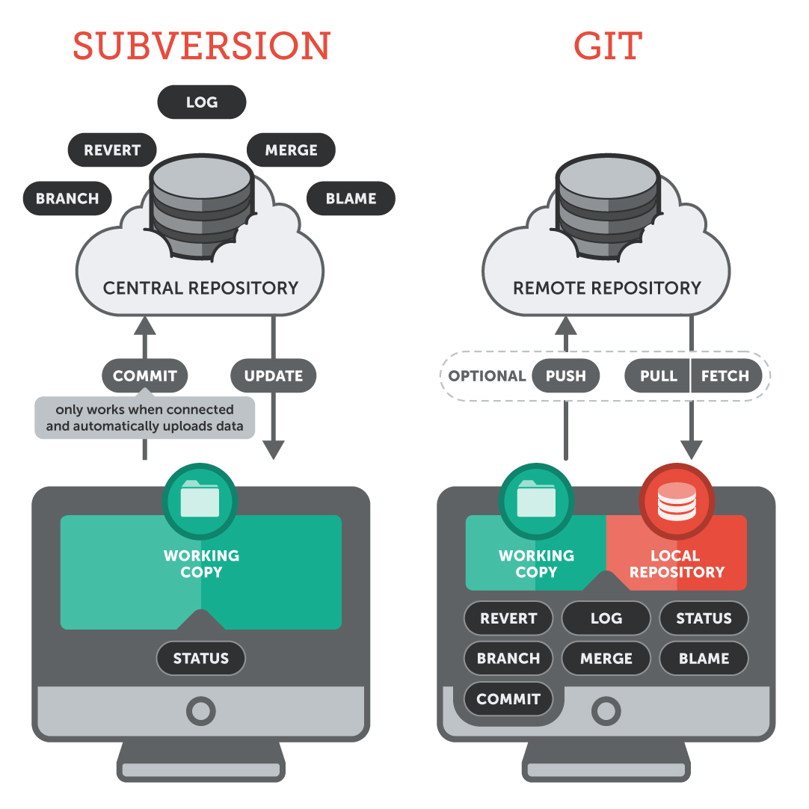

Los sistemas de control de versiones distribuidos (DCVS) han revolucionado la forma en que los desarrolladores colaboran y gestionan proyectos de software. A diferencia de los sistemas centralizados, donde existe un único servidor que contiene el historial completo del proyecto, en los DCVS cada colaborador posee una copia completa del repositorio, incluyendo todos los cambios realizados en el pasado, el historial de revisiones y las ramas.

## Características Clave de los DCVS

1. **Copia completa del repositorio en cada máquina:** En un DCVS, cada usuario clona el repositorio, obteniendo no solo una copia de los archivos actuales, sino todo el historial de cambios. Esto significa que, si el servidor central deja de estar disponible temporalmente (o incluso permanentemente), los desarrolladores pueden seguir trabajando localmente sin interrupciones. Cada copia local puede actuar como un respaldo completo del proyecto.

2. **Trabajar sin conexión:** Una de las mayores ventajas de los DCVS es que permiten trabajar sin estar conectado a un servidor. Como cada desarrollador tiene el historial completo en su máquina, puede realizar todas las operaciones importantes, como realizar commits, crear ramas y fusionar cambios, sin necesitar acceso a internet o a un servidor. Una vez que tenga acceso nuevamente, puede sincronizar sus cambios con el servidor o con otros colaboradores.

3. **Facilidad para la colaboración entre equipos**: Los DCVS permiten un flujo de trabajo más flexible y colaborativo. En lugar de depender de un único servidor central para realizar operaciones como la fusión de cambios (merge), los desarrolladores pueden intercambiar cambios directamente entre sus repositorios locales. Esto es especialmente útil en proyectos distribuidos globalmente, donde diferentes equipos pueden trabajar en diferentes partes del proyecto de manera independiente y luego fusionar sus cambios en el servidor central.

4. **Mejores fusiones y ramas**: En los sistemas distribuidos, las ramas y fusiones son procesos eficientes y fundamentales en el flujo de trabajo. Dado que cada desarrollador tiene el control sobre sus propias ramas locales, es fácil experimentar o trabajar en nuevas características sin afectar a los demás. Una vez que una característica o corrección está lista, el desarrollador puede fusionar su rama en el código principal. La estructura de los DCVS también permite manejar fusiones complejas de manera más ágil que en los sistemas centralizados.

5. **Mayor robustez y seguridad:** Dado que cada desarrollador tiene una copia completa del historial del proyecto, hay un menor riesgo de pérdida de datos. Incluso si el servidor central falla o es comprometido, cualquier desarrollador puede restaurar el repositorio a su estado completo desde su copia local. Además, las versiones distribuidas permiten un control más preciso sobre quién tiene acceso a qué partes del proyecto, mejorando la seguridad en proyectos grandes o confidenciales.

Dos de los sistemas de control de versiones más utilizados de cada tipo son SVN (subversion) como sistema centralizado y Git como sistema distribuído.

## Flujo de trabajo típico en un DCVS
1. **Clonar el repositorio:** Un desarrollador comienza clonando el repositorio central o uno remoto, creando una copia completa en su máquina.

2. **Trabajar de manera local:** Puede trabajar en el código, realizar commits localmente y crear ramas sin necesidad de estar conectado al servidor. Todos los cambios se guardan en su copia local del repositorio.

3. **Sincronización con el repositorio remoto:** Una vez que el desarrollador está listo para compartir su trabajo, puede "empujar" (push) los cambios al servidor o a otro repositorio remoto. Del mismo modo, puede "traer" (pull) los cambios realizados por otros colaboradores en el servidor.

4. **Fusiones y resolución de conflictos:** Cuando varios desarrolladores están trabajando en diferentes partes del código, pueden surgir conflictos. Git y otros DCVS están diseñados para gestionar estos conflictos, permitiendo a los desarrolladores fusionar sus cambios de manera eficiente y resolver conflictos si es necesario.

## Ejemplos de DCVS
Los sistemas distribuidos han ganado una enorme popularidad debido a su flexibilidad y eficiencia. Algunos de los más conocidos son:

- **Git:** El DCVS más popular hoy en día, utilizado por gigantes tecnológicos y proyectos de código abierto en todo el mundo.
- **Mercurial:** Otro sistema distribuido similar a Git, conocido por su simplicidad y facilidad de uso.

## Conclusión
Los sistemas de control de versiones distribuidos representan una evolución en la gestión de proyectos de software, ofreciendo una mayor flexibilidad, seguridad y eficiencia que los sistemas centralizados. Al permitir a los desarrolladores trabajar sin conexión, realizar cambios localmente y colaborar directamente con otros desarrolladores, los DCVS se han convertido en la opción predilecta para la mayoría de los proyectos modernos de software, siendo Git el ejemplo más destacado.
