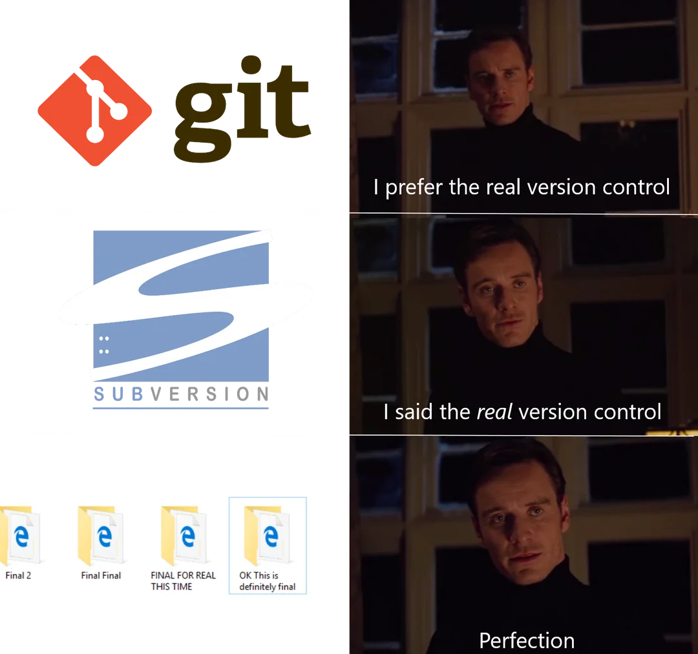

In software development, collaboration and code management are key aspects. When multiple people work on the same project or a developer makes continuous changes over time, it is essential to have a way to track and control these modifications. This is where **version control systems (VCS)** come into play.

## What is a Version Control System?
A version control system (VCS) is a tool that allows you to keep a detailed record of all changes made to a project, especially in the source code. With a VCS, it’s possible to see who made what change, when it was done, and if necessary, revert to a previous version or merge changes made by different collaborators.

VCS are used to prevent issues such as:

- **Accidentally overwriting work.** When multiple developers work on the same files, it’s easy for one to accidentally overwrite another’s work.
- **Difficulty in collaboration.** Without a VCS, integrating and coordinating contributions from multiple developers would be challenging.
- **Lack of history.** Without a record, it would be hard to understand how and why certain changes were made to the project.

## Types of Version Control Systems
There are two main types of version control systems:

1. **Centralized Version Control Systems (CVCS):** In this approach, the source code and its history are stored on a central server. Users get a copy of the code from the server, make changes, and then send them back. Examples: Subversion (SVN), Perforce.

2. **Distributed Version Control Systems (DVCS):** In this model, each collaborator has a complete copy of the project and its history on their own machine. This allows for offline work and advanced integration operations. Examples: Git, Mercurial.
